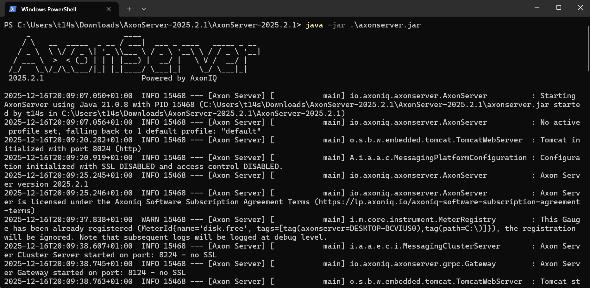
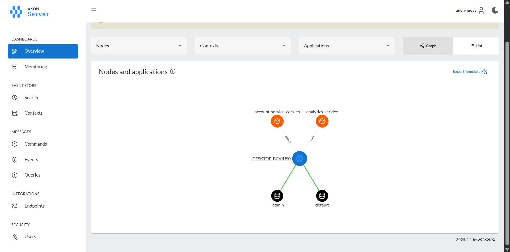
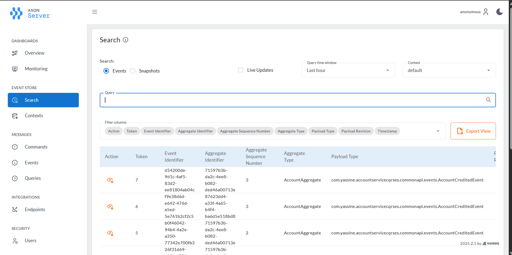
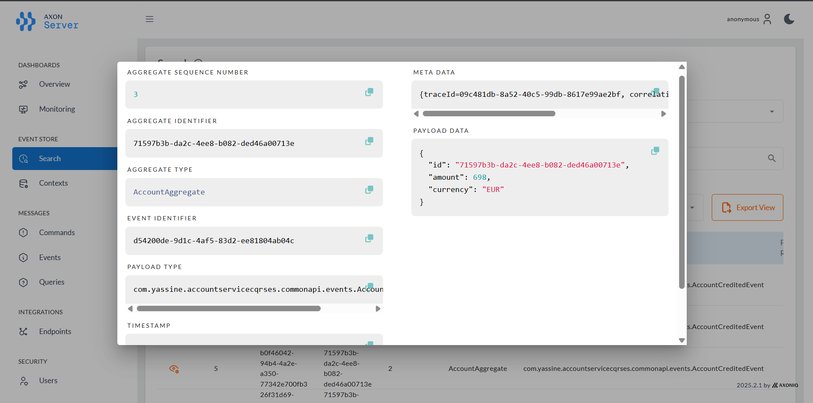
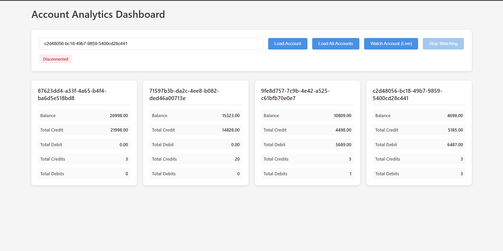
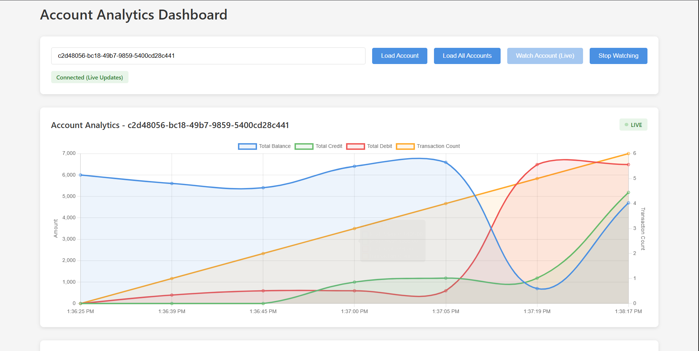

# Laboratoire CQRS et Event Sourcing

## Vue d'ensemble

Ce projet est une implémentation complète d'une architecture **CQRS (Command Query Responsibility Segregation)** et **Event Sourcing** utilisant **Axon Framework** avec Spring Boot. Il démontre comment construire un système bancaire distribué avec gestion d'événements et synchronisation en temps réel.

### Architecture générale

```
┌─────────────────────────────────────────────────────────────┐
│                     Client / Interface Web                   │
└──────────────────┬──────────────────────────────────────────┘
                   │
        ┌──────────┴──────────┐
        │                     │
   ┌────▼─────┐         ┌────▼─────────┐
   │ Commands  │         │   Queries    │
   │ (Écriture)│         │  (Lecture)   │
   └────┬─────┘         └────┬─────────┘
        │                     │
   ┌────▼──────────────────────▼─────┐
   │   Account Service (CQRS)         │
   │  - Aggregate (AccountAggregate)   │
   │  - Event Store (MySQL)            │
   │  - Query Model (MySQL)            │
   └────┬──────────────────────────────┘
        │
   ┌────▼────────────────────────────┐
   │  Analytics Service (Read Model)  │
   │  - Real-time Updates (SSE)       │
   │  - H2 Database                   │
   └─────────────────────────────────┘
```

## Structure du projet

```
account-service-cqrs-es/
├── src/main/java/com/yassine/accountservicecqrses/
│   ├── commands/
│   │   ├── aggregates/
│   │   │   └── AccountAggregate.java          
│   │   └── controllers/
│   │       └── AccountCommandController.java  
│   ├── query/
│   │   ├── entities/
│   │   │   ├── Account.java                   
│   │   │   └── AccountTransaction.java        
│   │   ├── queries/
│   │   │   └── GetAllAccountsQuery.java
│   │   ├── repositories/
│   │   ├── controllers/
│   │   │   └── AccountQueryController.java
│   │   └── service/
│   │       ├── AccountQueryHandler.java       
│   │       └── AccountEventHandler.java       
│   └── commonapi/
│       ├── commands/                          
│       ├── events/                            
│       ├── dtos/                              
│       └── enums/                             
├── analytics-service/                        
│   ├── src/main/java/com/yassine/analyticsservice/
│   │   ├── AnalyticsServiceApplication.java          
│   │   ├── controller/
│   │   │   └── AccountAnalyticsController.java       
│   │   ├── entities/
│   │   │   └── AccountAnalytics.java                 
│   │   ├── queries/
│   │   │   ├── GetAllAccountAnalytics.java           
│   │   │   └── GetAllAccountAnalyticsByAccountId.java
│   │   ├── repo/
│   │   │   └── AccountAnalyticsRepository.java       
│   │   └── service/
│   │       └── AccountAnalyticsEventHandler.java     
│   ├── src/main/resources/
│   │   ├── application.properties
│   │   ├── static/
│   │   │   └── chart.html                           
│   │   └── templates/
│   ├── pom.xml
│   └── mvnw/mvnw.cmd
├── screenshots/                               
└── pom.xml                                   
```

## Concepts clés

### 1. **CQRS (Command Query Responsibility Segregation)**

La séparation en deux chemins distincts :

- **Commandes (Write Model)** : Modifient l'état du système
  - `CreateAccountCommand` : Créer un compte
  - `CreditAccountCommand` : Créditer un compte
  - `DebitAccountCommand` : Débiter un compte

- **Requêtes (Read Model)** : Consultent l'état du système
  - `GetAllAccountsQuery` : Récupérer tous les comptes

### 2. **Event Sourcing**

L'état est reconstruit à partir d'une séquence d'événements :

- `AccountCreatedEvent` : Événement de création
- `AccountCreditedEvent` : Événement de crédit
- `AccountDebitedEvent` : Événement de débit

### 3. **Agrégat Racine**

[`AccountAggregate`](src/main/java/com/yassine/accountservicecqrses/commands/aggregates/AccountAggregate.java) encapsule la logique métier :
- Valide les commandes
- Émet les événements
- Reconstruit l'état à partir des événements

## Démarrage rapide

### Prérequis

- Java 17+
- Maven 3.6+
- MySQL 8.0+
- Axon Server (port 8024)

### Installation et configuration

#### 1. Démarrer Axon Server

```bash
# Télécharger et démarrer Axon Server
# Il sera disponible sur http://localhost:8024
```

#### 2. Configuration de la base de données MySQL

```sql
-- Créer la base de données
CREATE DATABASE dbEbank;
```

#### 3. Variables d'environnement

```bash
# Optionnel - les valeurs par défaut fonctionnent en local
export MYSQL_HOST=localhost
export MYSQL_PORT=3306
export MYSQL_USER=root
export MYSQL_PWD=
```

#### 4. Construire et lancer les services

```bash
# Service de comptes (port 8083)
./mvnw spring-boot:run

# Dans un autre terminal - Service d'analyse (port 8084)
cd analytics-service
../mvnw spring-boot:run
```

## Services

### Account Service (Port 8083)

**Endpoints de commandes :**

```http
POST /commands/account/create
Content-Type: application/json

{
  "currency": "EUR",
  "initialBalance": 1000.0
}

# Réponse : UUID du compte créé
```

```http
POST /commands/account/credit
Content-Type: application/json

{
  "accountId": "uuid-du-compte",
  "amount": 500.0,
  "currency": "EUR"
}
```

```http
POST /commands/account/debit
Content-Type: application/json

{
  "accountId": "uuid-du-compte",
  "amount": 200.0,
  "currency": "EUR"
}
```

**Endpoints de requêtes :**

```http
GET /query/accounts/list
# Récupère tous les comptes avec leur solde actuel

GET /commands/account/eventStore/{accountId}
# Affiche la séquence d'événements pour un compte
```

### Analytics Service (Port 8084)

**Architecture du service :**

```
┌──────────────────────────────────────────────────┐
│       Analytics Service - Microservice autonome  │
├──────────────────────────────────────────────────┤
│                                                  │
│  ┌─────────────────────────────────────────┐   │
│  │  AccountAnalyticsEventHandler            │   │
│  │  - Écoute les événements (SSE)          │   │
│  │  - Met à jour le modèle analytique      │   │
│  └────────────┬────────────────────────────┘   │
│               │                                 │
│  ┌────────────▼────────────────────────────┐   │
│  │  AccountAnalyticsRepository              │   │
│  │  - Accès à la base H2                    │   │
│  │  - Requêtes optimisées de lecture        │   │
│  └────────────┬────────────────────────────┘   │
│               │                                 │
│  ┌────────────▼────────────────────────────┐   │
│  │  AccountAnalyticsController              │   │
│  │  - GET /query/accountAnalytics           │   │
│  │  - GET /query/accountAnalytics/{id}      │   │
│  └──────────────────────────────────────────┘   │
│               │                                 │
│  ┌────────────▼────────────────────────────┐   │
│  │         chart.html (Dashboard)          │   │
│  │  - Visualisation Chart.js                │   │
│  │  - Connexion SSE en temps réel           │   │
│  └──────────────────────────────────────────┘   │
│                                                  │
└──────────────────────────────────────────────────┘
```

**Composants clés :**

| Composant | Description |
|-----------|-------------|
| [`AccountAnalyticsEventHandler`](analytics-service/src/main/java/com/yassine/analyticsservice/service/AccountAnalyticsEventHandler.java) | Reçoit les événements du Account Service via SSE et met à jour les statistiques |
| [`AccountAnalytics`](analytics-service/src/main/java/com/yassine/analyticsservice/entities/AccountAnalytics.java) | Entité de données : solde, total crédits, total débits, nombre transactions |
| [`AccountAnalyticsRepository`](analytics-service/src/main/java/com/yassine/analyticsservice/repo/AccountAnalyticsRepository.java) | Interface d'accès aux données (Spring Data JPA) |
| [`AccountAnalyticsController`](analytics-service/src/main/java/com/yassine/analyticsservice/controller/AccountAnalyticsController.java) | REST API pour consulter les analytiques |
| [`chart.html`](analytics-service/src/main/resources/static/chart.html) | Interface de visualisation avec Chart.js |

**Dashboard interactif :**

```
http://localhost:8084/chart.html
```

**Endpoints API :**

```http
GET /query/accountAnalytics
# Récupère les analytiques de tous les comptes
Réponse: { "accountId": "...", "balance": 1000, "totalCredit": 500, "totalDebit": 250 }

GET /query/accountAnalytics/{accountId}
# Récupère les analytiques d'un compte spécifique
Réponse: { "accountId": "uuid", "balance": 1000, "totalCredit": 500, ... }

GET /query/accountAnalytics/{accountId}/watch
# Stream SSE pour les mises à jour en temps réel
Réponse: Server-Sent Events (mises à jour instantanées)
```

## Interface utilisateur

### Dashboard Analytics

L'interface HTML fournie ([`chart.html`](analytics-service/src/main/resources/static/chart.html)) offre :

- **Graphiques en temps réel** : Visualisation des soldes, crédits et débits
- **Mises à jour en direct** : Connexion SSE pour les changements instantanés
- **Statistiques d'analyse** :
  - Solde total
  - Total des crédits et débits
  - Nombre de transactions
- **Contrôles interactifs** :
  - Charger un compte par ID
  - Charger tous les comptes
  - Surveiller un compte en direct

## Flux de traitement

### Flux de création de compte

```
1. Client soumet CreateAccountCommand
   ↓
2. AccountCommandController reçoit la commande
   ↓
3. CommandGateway envoie à AccountAggregate
   ↓
4. Agrégat valide et émet AccountCreatedEvent
   ↓
5. Event Sourcing stocke l'événement
   ↓
6. AccountEventHandler met à jour la Query Model (MySQL)
   ↓
7. AccountAnalyticsEventHandler met à jour les analytics (H2)
   ↓
8. Clients SSE reçoivent la mise à jour en temps réel
```

### Flux de débit/crédit

```
Client Command → Agrégat → Validation → Événement
     ↓                                      ↓
  QueryModel (Account) ← Event Handler     Analytics ← SSE Update
```

## Persistence

### Event Store (MySQL)

```sql
-- Stocke tous les événements de manière immuable
SELECT * FROM event_entry;
```

**Structure :**
- Agrégat ID
- Version de l'événement
- Timestamp
- Payload de l'événement (JSON)

### Query Model (MySQL)

```sql
-- Tables optimisées pour les lectures
SELECT * FROM account;
SELECT * FROM account_transaction;
```

### Analytics Database (H2)

```
-- En mémoire pour le développement
-- Accessible via http://localhost:8084/h2-console
```

## Validations métier

L'agrégat [`AccountAggregate`](src/main/java/com/yassine/accountservicecqrses/commands/aggregates/AccountAggregate.java) applique les règles suivantes :

```java
// ✗ Solde initial négatif
if (command.getInitialBalance() < 0) {
    throw new RuntimeException("Initial balance cannot be negative");
}

// ✗ Montant à créditer/débiter négatif
if (command.getAmount() < 0) {
    throw new RuntimeException("Amount cannot be negative");
}

// ✗ Solde insuffisant pour le débit
if (this.balance < command.getAmount()) {
    throw new RuntimeException("Insufficient balance");
}
```

## Captures d'écran

### Démarrage Axon Server

*Console de démarrage d'Axon Server*

### Vue d'ensemble Axon Server

*Dashboard Axon Server montrant les applications connectées*

### Recherche d'événements

*Interface de recherche des événements dans Axon Server*

### Event Store

*Détails d'un événement AccountCreditedEvent dans l'Event Store*

### Analytics - Tous les comptes

*Vue globale des analytiques pour tous les comptes*

### Dashboard Analytics en temps réel

*Visualisation des transactions en temps réel avec mise à jour SSE*


## Technologie

| Composant | Version | Rôle |
|-----------|---------|------|
| Spring Boot | 3.5.7/3.5.8 | Framework principal |
| Axon Framework | 4.10.3 | CQRS & Event Sourcing |
| MySQL | 8.0+ | Event Store & Query Model |
| H2 | Latest | Analytics Database |
| Chart.js | 4.4.0 | Graphiques en temps réel |
| Lombok | Latest | Réduction du boilerplate |
| Reactor | Latest | Programmation réactive |

## Configuration

### [`application.properties`](src/main/resources/application.properties) (Account Service)

```properties
spring.application.name=account-service-cqrs-es
server.port=8083
spring.datasource.url=jdbc:mysql://localhost:3306/dbEbank
spring.datasource.username=root
spring.datasource.password=
spring.jpa.hibernate.ddl-auto=create
spring.jpa.properties.hibernate.dialect=org.hibernate.dialect.MariaDBDialect
axon.serializer.events=jackson
axon.serializer.messages=xstream
axon.serializer.general=jackson
```

### [`application.properties`](analytics-service/src/main/resources/application.properties) (Analytics Service)

```properties
spring.application.name=analytics-service
server.port=8084
spring.datasource.url=jdbc:h2:mem:analyticsdb
spring.h2.console.enabled=true
axon.serializer.events=jackson
axon.serializer.messages=xstream
axon.serializer.general=jackson
```

## Points d'apprentissage

1. **Séparation des responsabilités** : CQRS crée deux modèles distincts
2. **Immuabilité des événements** : L'historique ne peut pas être modifié
3. **Reconstitution d'état** : Rejouer les événements pour obtenir l'état actuel
4. **Eventual Consistency** : Délai entre écriture et lecture
5. **Scalabilité** : Modèles de lecture et d'écriture indépendants
6. **Time Travel** : Reconstruction de tout état passé

## Ressources supplémentaires

- [Documentation Axon Framework](https://docs.axoniq.io/)
- [Pattern CQRS - Martin Fowler](https://martinfowler.com/bliki/CQRS.html)
- [Event Sourcing](https://martinfowler.com/eaaDev/EventSourcing.html)

## Auteur

Yassine IDRISSI - Implémentation du laboratoire CQRS et Event Sourcing

---
